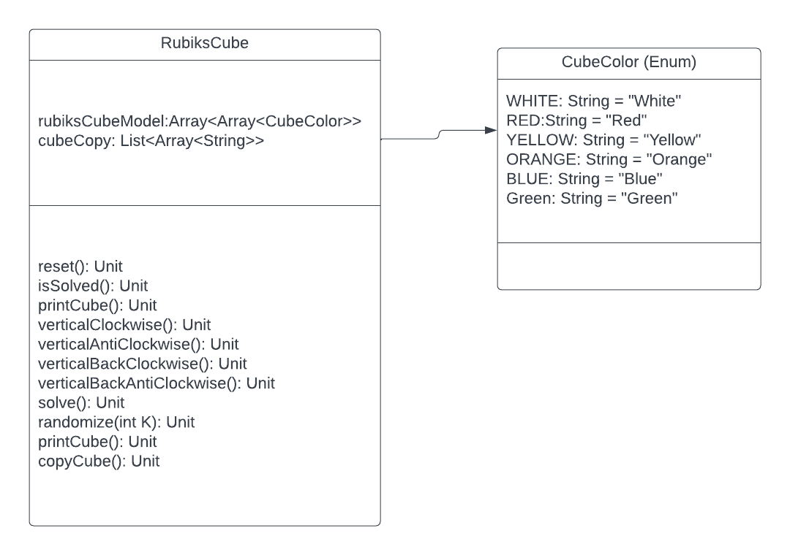

Name: Muhammad Mujtaba
Class: Artificial Intelligence (CSC372)
Assignment 1

Class Descriptions

RubiksCube.kt

This class has implementation for RubiksCube. This class includes all the methods
for the rubiks cube mentioned on the UML diagram

CubeColor.kt

This is just a Enum class with all the different colors that exist on the 
rubiks cube as well as a printableName for each of the color

main.kt

This is the class which has the main method and we will be using this 
class to invoke methods and run our program